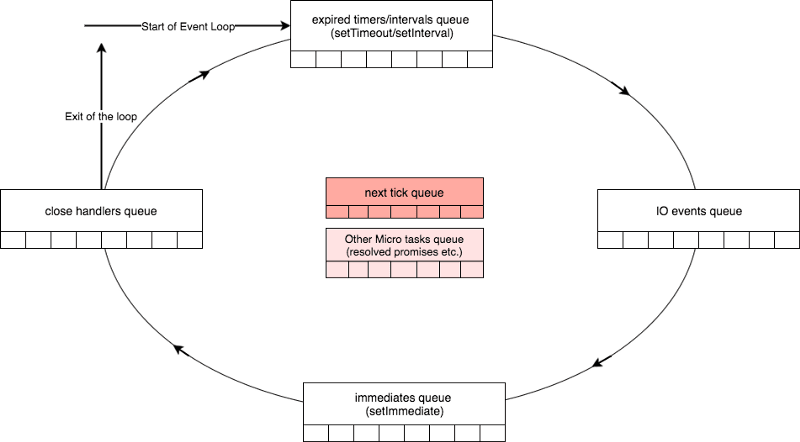

# python-workbook

## Visual material

### Source code

### Event loop circle

### Docker

### Relational DB

### Timezones

### Queue

### OOP

### Serialization

## SQL

### ER-model

Whole numbers

Data types: date and time

### JOIN: Joining tables

## NoSQL

### CAP theorem

The following table presents the differences in terminology between SQL and MongoDB.
